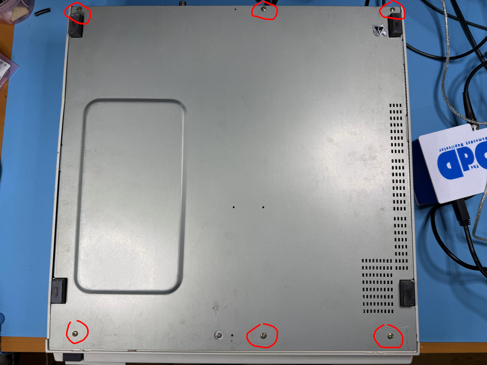
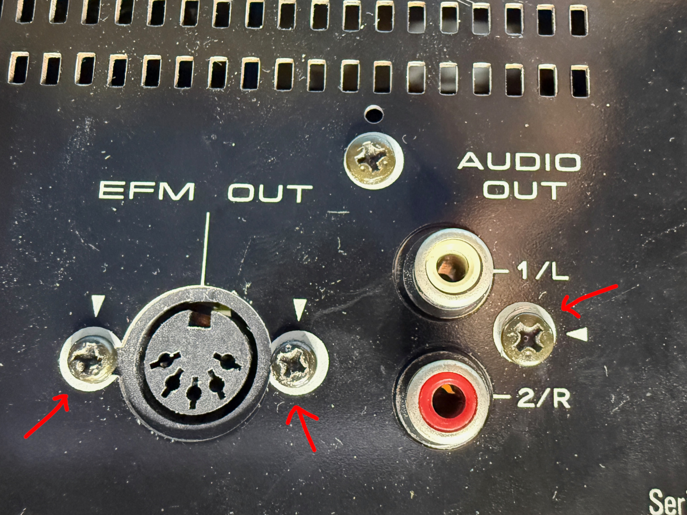
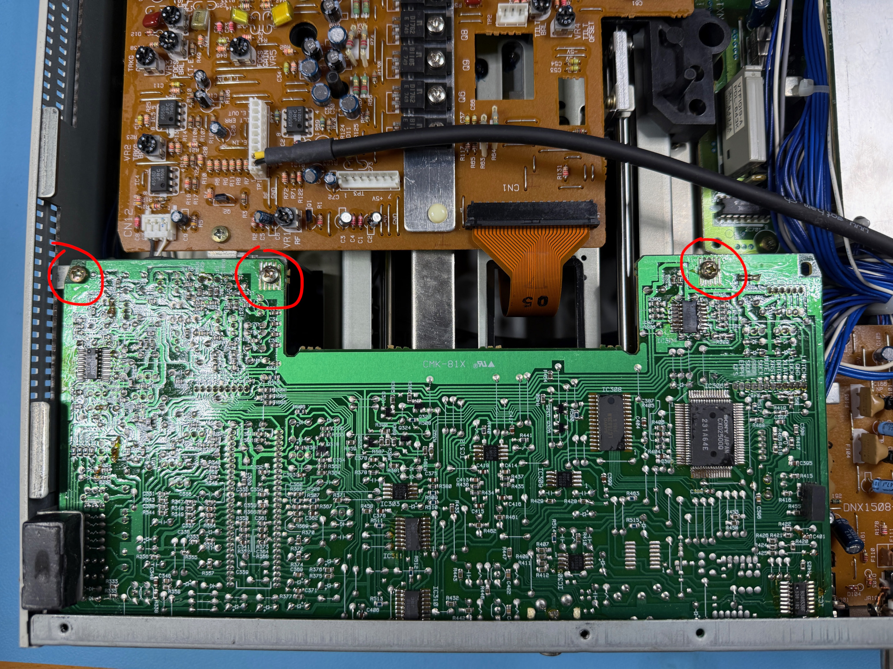
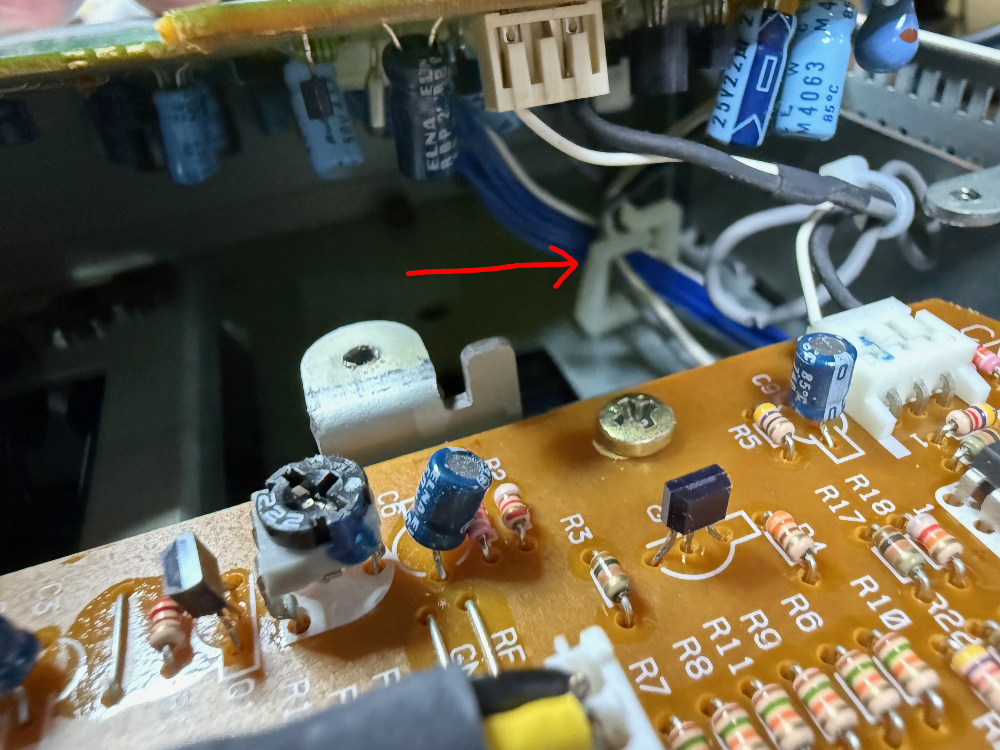
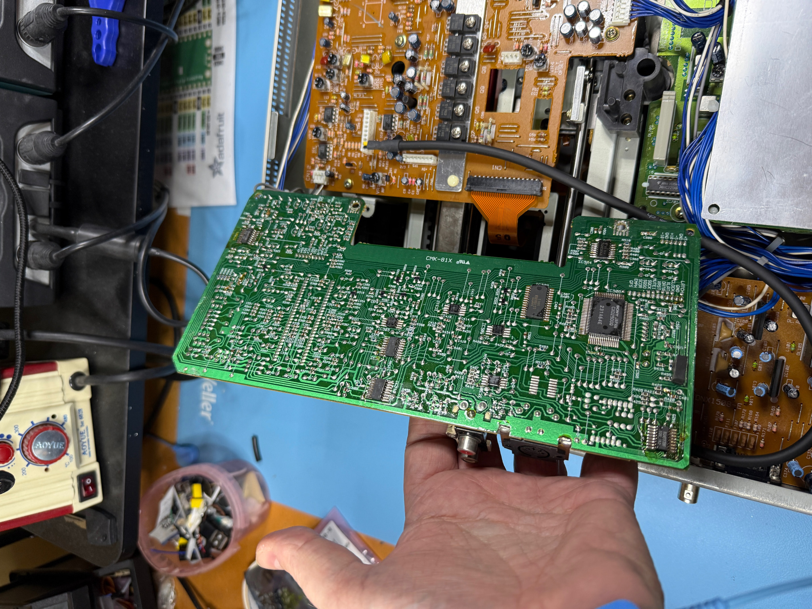
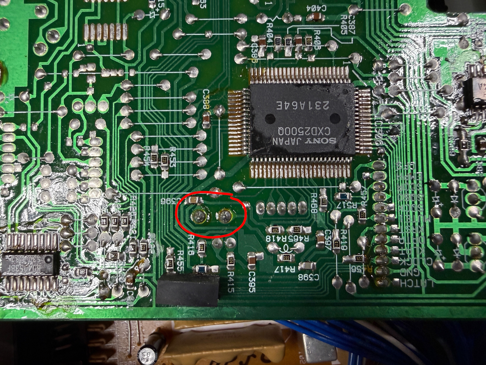
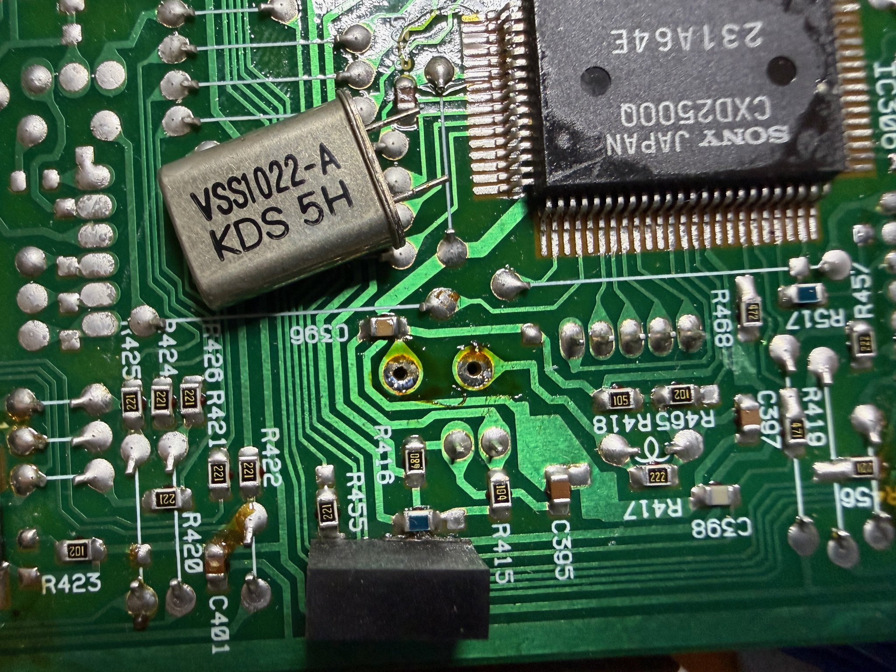

# Removing the EFM crystal

# Overview
The reference LD-V4300D LaserDisc player produces an unwanted signal in the RF output around 8.5MHz which can interfere with PAL captures.

The unwanted signal is caused by the EFM decoder IC's clock on the AUDB board and injected via the CN12 board interconnect cable.

To remove this unwanted signal it's possible to simply remove the clock from the AUDB board.

!!! warning "Caution"
    Removing the clock will disable all EFM functionality - the player will no longer output digital sound via the backpanel connectors.

You will need a soldering iron, some de-soldering wick, flux and a correctly grounded anti-static band.

# Instructions

## Remove the bottom plate

Turn the player upside down on the bench and remove the 6 screws shown in the following photograph:

With the screws removed, the bottom panel should easily lift out to expose the circuit boards at the bottom of the player.

## Remove the connector screws

At the back of the player you will find 3 screws holding the audio out and EFM out connectors in place.

Remove all 3 screws - keep note of which screw goes where - the audio out screw is different from the EFM screws.

## Remove the AUDB PCB screws

There are 3 screws along the front of the AUDB PCB which also need to be removed.

## Releasing the cables under the AUDB PCB

Now that all the screws are removed it's possible to lift the AUDB board slightly by the front edge.

!!! warning "Caution"
    Do not force the board up - there are cables under the board which restrict the movement.

You will need to get your hand under the board and release the cables from the cable holder shown in the following photo.

Once released the board should come up easily - note that the cables on the right-hand side of the board will stop you from completely lifting the board.  This is ok, you do not need to remove it completely.

The board should be as shown in the following photograph:

## Locating the crystal

The crystal is a standard quartz 'can' and has two terminals on the left of the AUBD PCB shown in the following photograph:

Using de-soldering wick (such as Chemtronics Soder-Wick size #3) and a good soldering iron - put some flux around the two terminals and remove the solder with the wick.  Make sure the solder is removed - the crystal should just fall out of the PCB (be careful not to drop it into the player).

Once removed it should look like the following photo (crystal shown here just for reference):

## Reassemble

To reassemble follow the assembly instructions in reverse. Make sure the cables are placed back in the cable holder and ensure that the PCB is slotted into the holder in the back panel correctly.  Double check that the PCB is flat and square before screwing it back in.

Keep the removed crystal in an anti-static bag - if you need to reverse the modification, you can simply solder the crystal back in place.

